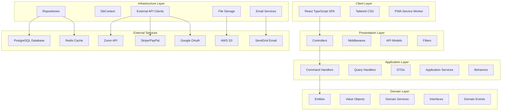

# Design Document

## Overview

The Autism Center Website is designed as a modern, scalable web application using a microservices-oriented architecture. The system consists of a React TypeScript frontend with Tailwind CSS for styling, a .NET Core Web API backend, and a PostgreSQL database. The architecture emphasizes security, accessibility, performance, and maintainability while supporting bilingual content and role-based access control.

### Key Design Principles

- **Accessibility First**: WCAG 2.1 compliance throughout the application
- **Security by Design**: End-to-end encryption, secure authentication, and PCI DSS compliance
- **Responsive Design**: Mobile-first approach with progressive enhancement
- **Internationalization**: Native support for Arabic (RTL) and English (LTR) layouts
- **Scalability**: Modular architecture supporting horizontal scaling
- **Performance**: Optimized loading times and efficient data handling

## Architecture

### System Architecture Overview



### Frontend Architecture

The frontend follows a component-based architecture with the following structure:

- **Pages**: Route-level components for each major section
- **Components**: Reusable UI components with TypeScript interfaces
- **Hooks**: Custom React hooks for state management and API calls
- **Services**: API communication layer with axios
- **Utils**: Helper functions for formatting, validation, and localization
- **Context**: Global state management for authentication and language preferences

### Backend Architecture

The backend implements Clean Architecture with four distinct layers following dependency inversion principles:

#### 1. Domain/Core Layer (Innermost - No Dependencies)
Contains the business logic and domain models. This layer is independent and can be accessed by other layers.

**Components:**
- **Entities**: Core business objects (User, Product, Course, Appointment, Order)
- **Value Objects**: Immutable objects representing domain concepts (Email, Money, Address)
- **Domain Services**: Business logic that doesn't belong to a specific entity
- **Interfaces**: Contracts for repositories and external services
- **Domain Events**: Events triggered by domain operations
- **Specifications**: Business rules and validation logic
- **Enums**: Domain-specific enumerations (UserRole, OrderStatus, AppointmentStatus)
- **Exceptions**: Domain-specific exceptions
- **Aggregates**: Consistency boundaries for related entities

#### 2. Application Layer (Use Cases - Depends only on Domain)
Orchestrates the flow of data and coordinates domain objects to perform use cases.

**Components:**
- **Commands**: Write operations (CreateUser, PlaceOrder, BookAppointment)
- **Queries**: Read operations (GetProducts, GetUserOrders, GetAvailableSlots)
- **Command Handlers**: Process commands and coordinate domain operations
- **Query Handlers**: Process queries and return DTOs
- **DTOs**: Data Transfer Objects for communication between layers
- **Behaviors**: Cross-cutting concerns (validation, logging, caching)
- **Application Services**: Coordinate complex use cases
- **Interfaces**: Contracts for infrastructure services

#### 3. Infrastructure Layer (Depends on Application)
Implements external concerns and provides concrete implementations of interfaces defined in inner layers.

**Components:**
- **Repositories**: Data access implementations using Entity Framework Core
- **DbContext**: Database context and configuration
- **API Clients**: External service integrations (Zoom, Stripe, SendGrid)
- **File System Accessors**: File storage implementations (AWS S3, local storage)
- **Email Services**: Email sending implementations
- **SMS Services**: SMS notification implementations
- **Caching**: Redis cache implementations
- **Authentication**: JWT token services and OAuth implementations
- **System Services**: Date/time, logging, configuration services

#### 4. Presentation Layer (Depends on Application)
Handles HTTP requests and responses, providing the API interface.

**Components:**
- **Controllers**: API endpoints handling HTTP requests
- **Middlewares**: Cross-cutting HTTP concerns (authentication, error handling, logging)
- **API Models**: Request/response models specific to the API
- **Filters**: Action filters for validation, authorization
- **Model Binders**: Custom model binding logic
- **Composition Root**: Dependency injection configuration
- **Health Checks**: Application health monitoring endpoints

#### Dependency Flow
```
Domain Layer (Core) ← Application Layer ← Infrastructure Layer
                                      ← Presentation Layer
```

**Key Principles:**
- Domain layer has no external dependencies
- Application layer only references Domain layer
- Infrastructure and Presentation layers reference Application layer
- All dependencies point inward toward the Domain layer

#### Example Clean Architecture Implementation

**Domain Layer Example:**
```csharp
// Domain/Entities/User.cs
public class User : BaseEntity
{
    public Email Email { get; private set; }
    public UserRole Role { get; private set; }
    public Language PreferredLanguage { get; private set; }
    
    public void ChangeEmail(Email newEmail)
    {
        // Business logic for email change
        Email = newEmail;
        AddDomainEvent(new UserEmailChangedEvent(Id, newEmail));
    }
}

// Domain/Interfaces/IUserRepository.cs
public interface IUserRepository
{
    Task<User> GetByIdAsync(UserId id);
    Task<User> GetByEmailAsync(Email email);
    Task AddAsync(User user);
}
```

**Application Layer Example:**
```csharp
// Application/Commands/CreateUserCommand.cs
public record CreateUserCommand(string Email, string FirstName, string LastName) : IRequest<UserDto>;

// Application/Handlers/CreateUserHandler.cs
public class CreateUserHandler : IRequestHandler<CreateUserCommand, UserDto>
{
    private readonly IUserRepository _userRepository;
    private readonly IEmailService _emailService;
    
    public async Task<UserDto> Handle(CreateUserCommand request, CancellationToken cancellationToken)
    {
        var email = Email.Create(request.Email);
        var user = User.Create(email, request.FirstName, request.LastName);
        
        await _userRepository.AddAsync(user);
        await _emailService.SendWelcomeEmailAsync(user.Email);
        
        return UserDto.FromEntity(user);
    }
}
```

**Infrastructure Layer Example:**
```csharp
// Infrastructure/Repositories/UserRepository.cs
public class UserRepository : IUserRepository
{
    private readonly ApplicationDbContext _context;
    
    public async Task<User> GetByEmailAsync(Email email)
    {
        return await _context.Users
            .FirstOrDefaultAsync(u => u.Email == email.Value);
    }
}

// Infrastructure/Services/EmailService.cs
public class EmailService : IEmailService
{
    private readonly ISendGridClient _sendGridClient;
    
    public async Task SendWelcomeEmailAsync(Email email)
    {
        // SendGrid implementation
    }
}
```

**Presentation Layer Example:**
```csharp
// Presentation/Controllers/UsersController.cs
[ApiController]
[Route("api/[controller]")]
public class UsersController : ControllerBase
{
    private readonly IMediator _mediator;
    
    [HttpPost]
    public async Task<ActionResult<UserDto>> CreateUser(CreateUserRequest request)
    {
        var command = new CreateUserCommand(request.Email, request.FirstName, request.LastName);
        var result = await _mediator.Send(command);
        return Ok(result);
    }
}
```

## Components and Interfaces

### Core Components

#### 1. Authentication System

**Components:**
- `LoginForm`: Email/password and Google OAuth login
- `RegisterForm`: User registration with email verification
- `PasswordReset`: Password recovery functionality
- `AuthGuard`: Route protection component

**Interfaces:**
```typescript
interface User {
  id: string;
  email: string;
  firstName: string;
  lastName: string;
  role: UserRole;
  preferredLanguage: 'en' | 'ar';
  isEmailVerified: boolean;
  createdAt: Date;
}

interface AuthState {
  user: User | null;
  token: string | null;
  isAuthenticated: boolean;
  isLoading: boolean;
}
```

#### 2. E-commerce Module

**Components:**
- `ProductCatalog`: Grid/list view of products with filtering
- `ProductCard`: Individual product display component
- `ShoppingCart`: Cart management with quantity controls
- `CheckoutForm`: Multi-step checkout process
- `OrderHistory`: User's order tracking interface

**Interfaces:**
```typescript
interface Product {
  id: string;
  nameEn: string;
  nameAr: string;
  descriptionEn: string;
  descriptionAr: string;
  price: number;
  currency: 'USD' | 'BHD';
  stockQuantity: number;
  categoryId: string;
  imageUrls: string[];
  isActive: boolean;
}

interface CartItem {
  productId: string;
  quantity: number;
  price: number;
}

interface Order {
  id: string; // Unique order identifier (UUID)
  orderNumber: string; // Human-readable order number (e.g., "ORD-2024-001234")
  userId: string;
  items: CartItem[];
  totalAmount: number;
  currency: 'USD' | 'BHD';
  status: OrderStatus;
  paymentId: string;
  paymentStatus: PaymentStatus;
  shippingAddress: Address;
  billingAddress: Address;
  createdAt: Date;
  updatedAt: Date;
  shippedAt?: Date;
  deliveredAt?: Date;
}

enum OrderStatus {
  PENDING = 'pending',
  CONFIRMED = 'confirmed',
  PROCESSING = 'processing',
  SHIPPED = 'shipped',
  DELIVERED = 'delivered',
  CANCELLED = 'cancelled',
  REFUNDED = 'refunded'
}

enum PaymentStatus {
  PENDING = 'pending',
  COMPLETED = 'completed',
  FAILED = 'failed',
  REFUNDED = 'refunded'
}
```

#### 3. Course Management System

**Components:**
- `CourseCatalog`: Available courses with enrollment options
- `VideoPlayer`: Secure video streaming component
- `ProgressTracker`: Course completion tracking
- `CertificateGenerator`: PDF certificate creation
- `CourseNavigation`: Module and lesson navigation

**Interfaces:**
```typescript
interface Course {
  id: string;
  titleEn: string;
  titleAr: string;
  descriptionEn: string;
  descriptionAr: string;
  duration: number;
  thumbnailUrl: string;
  modules: CourseModule[];
  isActive: boolean;
}

interface Enrollment {
  id: string;
  userId: string;
  courseId: string;
  enrollmentDate: Date;
  expiryDate: Date;
  progress: number;
  completionDate?: Date;
  certificateUrl?: string;
}
```

#### 4. Appointment Scheduling

**Components:**
- `CalendarView`: Available appointment slots display
- `AppointmentForm`: Booking form with patient information
- `AppointmentList`: User's scheduled appointments
- `ZoomIntegration`: Meeting link generation and display

**Interfaces:**
```typescript
interface Appointment {
  id: string;
  userId: string;
  doctorId: string;
  appointmentDate: Date;
  status: AppointmentStatus;
  zoomLink: string;
  patientInfo: PatientInfo;
  notes?: string;
}

interface Doctor {
  id: string;
  nameEn: string;
  nameAr: string;
  specialtyEn: string;
  specialtyAr: string;
  availability: DoctorAvailability[];
}
```

#### 5. Admin Dashboard

**Components:**
- `DashboardOverview`: Key metrics and analytics
- `UserManagement`: User roles and permissions
- `InventoryManagement`: Product and stock management
- `OrderManagement`: Order processing and fulfillment
- `ContentManagement`: Bilingual content editing
- `ReportsModule`: Data export and analytics

### API Endpoints Design

#### Authentication Endpoints
- `POST /api/auth/register` - User registration
- `POST /api/auth/login` - Email/password login
- `POST /api/auth/google` - Google OAuth login
- `POST /api/auth/verify-email` - Email verification
- `POST /api/auth/forgot-password` - Password reset request
- `POST /api/auth/reset-password` - Password reset confirmation

#### E-commerce Endpoints
- `GET /api/products` - Get products with filtering and pagination
- `GET /api/products/{id}` - Get product details by unique product ID
- `POST /api/cart/add` - Add item to authenticated user's cart
- `GET /api/cart` - Get authenticated user's current cart
- `PUT /api/cart/items/{productId}` - Update cart item quantity
- `DELETE /api/cart/items/{productId}` - Remove item from cart
- `POST /api/orders` - Create order (returns unique order ID)
- `GET /api/orders` - Get authenticated user's order history
- `GET /api/orders/{orderId}` - Get specific order details by unique order ID
- `PUT /api/orders/{orderId}/status` - Update order status (admin only)

#### Course Endpoints
- `GET /api/courses` - Get available courses
- `POST /api/enrollments` - Enroll in course
- `GET /api/enrollments/{id}/progress` - Get course progress
- `GET /api/courses/{id}/content` - Get secure video URLs

#### Appointment Endpoints
- `GET /api/appointments/availability` - Get available slots
- `POST /api/appointments` - Book appointment
- `GET /api/appointments` - Get user's appointments
- `PUT /api/appointments/{id}` - Update appointment

## Data Models

### Database Schema Design

The PostgreSQL database implements the following key entities:

#### Users Table
```sql
CREATE TABLE Users (
    Id UUID PRIMARY KEY DEFAULT gen_random_uuid(),
    Email VARCHAR(255) UNIQUE NOT NULL,
    PasswordHash VARCHAR(255),
    FirstName VARCHAR(100) NOT NULL,
    LastName VARCHAR(100) NOT NULL,
    Role VARCHAR(50) NOT NULL,
    PreferredLanguage VARCHAR(2) DEFAULT 'en',
    IsEmailVerified BOOLEAN DEFAULT FALSE,
    GoogleId VARCHAR(255),
    CreatedAt TIMESTAMP WITH TIME ZONE DEFAULT NOW(),
    UpdatedAt TIMESTAMP WITH TIME ZONE DEFAULT NOW()
);
```

#### Products Table
```sql
CREATE TABLE Products (
    Id UUID PRIMARY KEY DEFAULT gen_random_uuid(),
    NameEn VARCHAR(255) NOT NULL,
    NameAr VARCHAR(255) NOT NULL,
    DescriptionEn TEXT,
    DescriptionAr TEXT,
    Price DECIMAL(10,2) NOT NULL,
    StockQuantity INTEGER NOT NULL DEFAULT 0,
    CategoryId UUID REFERENCES Categories(Id),
    ImageUrls TEXT[],
    IsActive BOOLEAN DEFAULT TRUE,
    CreatedAt TIMESTAMP WITH TIME ZONE DEFAULT NOW()
);
```

#### Orders Table
```sql
CREATE TABLE Orders (
    Id UUID PRIMARY KEY DEFAULT gen_random_uuid(),
    OrderNumber VARCHAR(50) UNIQUE NOT NULL, -- Human-readable order number
    UserId UUID REFERENCES Users(Id) NOT NULL,
    TotalAmount DECIMAL(10,2) NOT NULL,
    Currency VARCHAR(3) NOT NULL DEFAULT 'BHD',
    Status VARCHAR(50) NOT NULL DEFAULT 'pending',
    PaymentId VARCHAR(255),
    PaymentStatus VARCHAR(50) NOT NULL DEFAULT 'pending',
    ShippingAddress JSONB NOT NULL,
    BillingAddress JSONB NOT NULL,
    CreatedAt TIMESTAMP WITH TIME ZONE DEFAULT NOW(),
    UpdatedAt TIMESTAMP WITH TIME ZONE DEFAULT NOW(),
    ShippedAt TIMESTAMP WITH TIME ZONE,
    DeliveredAt TIMESTAMP WITH TIME ZONE,
    
    CONSTRAINT chk_order_status CHECK (Status IN ('pending', 'confirmed', 'processing', 'shipped', 'delivered', 'cancelled', 'refunded')),
    CONSTRAINT chk_payment_status CHECK (PaymentStatus IN ('pending', 'completed', 'failed', 'refunded')),
    CONSTRAINT chk_currency CHECK (Currency IN ('USD', 'BHD'))
);

-- Index for efficient order lookups
CREATE INDEX idx_orders_user_id ON Orders(UserId);
CREATE INDEX idx_orders_status ON Orders(Status);
CREATE INDEX idx_orders_created_at ON Orders(CreatedAt);
CREATE UNIQUE INDEX idx_orders_order_number ON Orders(OrderNumber);
```

### Entity Relationships

- **Users** have many **Orders**, **Enrollments**, and **Appointments**
- **Products** belong to **Categories** and appear in **OrderItems**
- **Courses** contain many **CourseModules** and have many **Enrollments**
- **Doctors** have many **Appointments** and **DoctorAvailability** records
- **Orders** contain many **OrderItems**

### Unique Identifier Strategy

**Primary Keys (UUIDs):**
- All entities use UUID (Universally Unique Identifier) as primary keys
- Generated using `gen_random_uuid()` in PostgreSQL
- Provides global uniqueness and security (non-sequential)
- Enables distributed system compatibility

**Human-Readable Identifiers:**
- **Orders**: `OrderNumber` format: `ORD-YYYY-NNNNNN` (e.g., "ORD-2024-001234")
- **Appointments**: `AppointmentNumber` format: `APT-YYYY-NNNNNN`
- **Courses**: `CourseCode` format: `CRS-NNNN` (e.g., "CRS-0001")
- **Products**: `ProductSKU` format: `PRD-NNNN` (e.g., "PRD-0001")

**Benefits:**
- **UUIDs**: Ensure global uniqueness and prevent enumeration attacks
- **Human-readable IDs**: Easy reference for customer service and user communication
- **Indexing**: Proper database indexing for efficient lookups
- **Audit Trail**: Unique identifiers enable comprehensive tracking and logging

## Error Handling

### Frontend Error Handling

- **Global Error Boundary**: Catches and displays user-friendly error messages
- **API Error Interceptor**: Handles HTTP errors and token refresh
- **Form Validation**: Real-time validation with clear error messages
- **Network Error Handling**: Offline detection and retry mechanisms

### Backend Error Handling

- **Global Exception Middleware**: Standardized error responses
- **Validation Errors**: Model validation with detailed error messages
- **Business Logic Errors**: Custom exceptions with appropriate HTTP status codes
- **External Service Errors**: Graceful degradation when third-party services fail

### Error Response Format

```typescript
interface ApiError {
  message: string;
  code: string;
  details?: Record<string, string[]>;
  timestamp: string;
  traceId: string;
}
```

## Testing Strategy

### Frontend Testing

- **Unit Tests**: Jest and React Testing Library for components
- **Integration Tests**: API integration and user flow testing
- **E2E Tests**: Cypress for critical user journeys
- **Accessibility Tests**: Automated WCAG compliance testing

### Backend Testing

- **Unit Tests**: xUnit for business logic and services
- **Integration Tests**: In-memory database testing
- **API Tests**: Postman/Newman for endpoint testing
- **Performance Tests**: Load testing for scalability validation

### Test Coverage Goals

- **Unit Tests**: 80% code coverage minimum
- **Integration Tests**: All API endpoints covered
- **E2E Tests**: Critical user paths (registration, purchase, booking)
- **Accessibility Tests**: All pages meet WCAG 2.1 AA standards

### Testing Environments

- **Development**: Local testing with test database
- **Staging**: Production-like environment for integration testing
- **Production**: Monitoring and health checks

## Security Considerations

### Authentication & Authorization

- **JWT Tokens**: Short-lived access tokens with refresh token rotation
- **Role-Based Access Control**: Granular permissions for different user types
- **OAuth Integration**: Secure Google authentication implementation
- **Session Management**: Automatic logout after inactivity

### Data Protection

- **Encryption**: AES-256 encryption for sensitive data at rest
- **HTTPS**: TLS 1.3 for all communications
- **Input Validation**: Server-side validation for all user inputs
- **SQL Injection Prevention**: Parameterized queries and ORM usage

### Payment Security

- **PCI DSS Compliance**: Secure payment processing standards
- **Tokenization**: Credit card data tokenization through payment providers
- **Secure Checkout**: SSL encryption and secure payment forms

### Privacy & Compliance

- **Data Minimization**: Collect only necessary user information
- **Right to Deletion**: User data deletion capabilities
- **Audit Logging**: Comprehensive logging for security monitoring
- **Regular Security Audits**: Periodic vulnerability assessments

## Performance Optimization

### Frontend Performance

- **Code Splitting**: Lazy loading of route components
- **Image Optimization**: WebP format with fallbacks
- **Caching Strategy**: Service worker for offline functionality
- **Bundle Optimization**: Tree shaking and minification

### Backend Performance

- **Database Indexing**: Optimized queries with proper indexes
- **Caching Layer**: Redis for frequently accessed data
- **Connection Pooling**: Efficient database connection management
- **API Rate Limiting**: Prevent abuse and ensure fair usage

### Content Delivery

- **CDN Integration**: Static asset delivery optimization
- **Video Streaming**: Adaptive bitrate streaming for courses
- **Compression**: Gzip compression for API responses
- **Database Optimization**: Query optimization and connection pooling

## Deployment Architecture

### Infrastructure

- **Cloud Platform**: AWS or Azure for scalability and reliability
- **Container Orchestration**: Docker containers with Kubernetes
- **Load Balancing**: Application load balancer for high availability
- **Auto Scaling**: Horizontal scaling based on demand

### CI/CD Pipeline

- **Source Control**: Git with feature branch workflow
- **Build Pipeline**: Automated testing and building
- **Deployment Pipeline**: Blue-green deployment strategy
- **Monitoring**: Application performance monitoring and alerting

### Environment Management

- **Development**: Local development with Docker Compose
- **Staging**: Production-like environment for testing
- **Production**: High-availability production deployment
- **Backup Strategy**: Automated database backups and disaster recovery